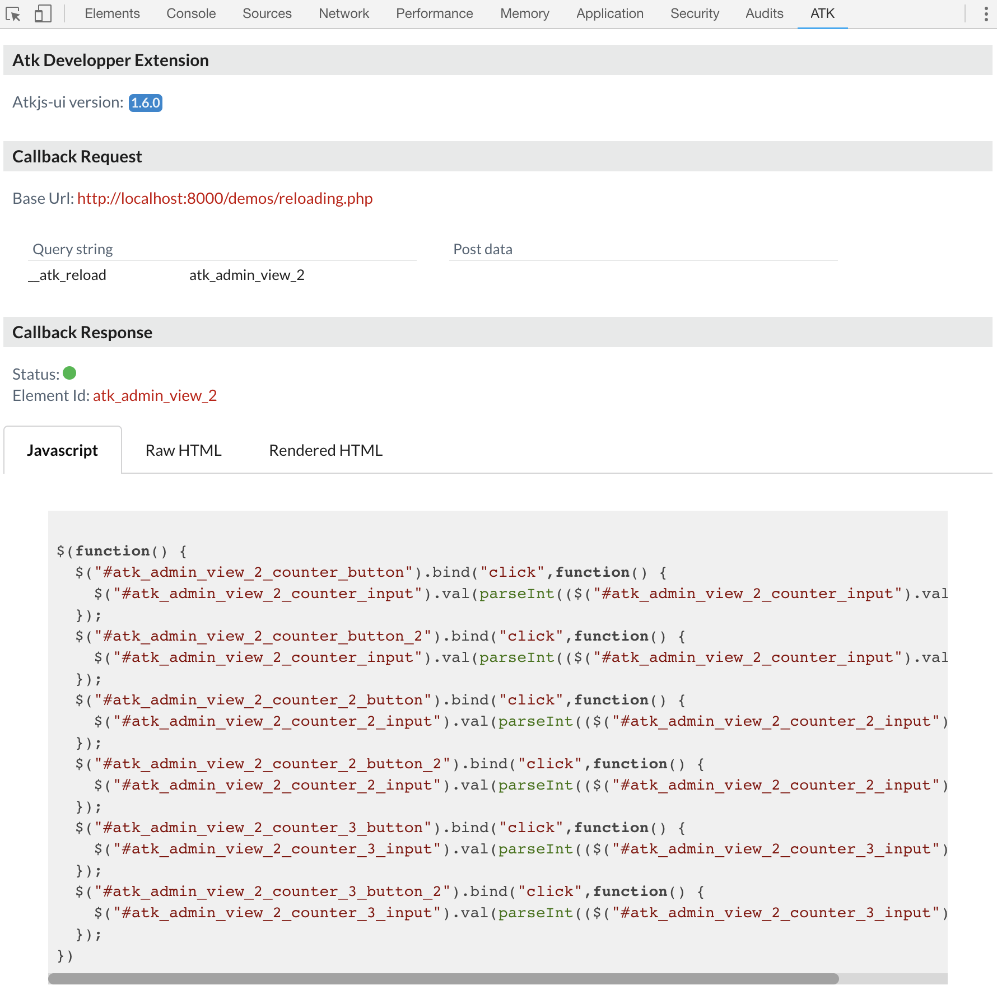
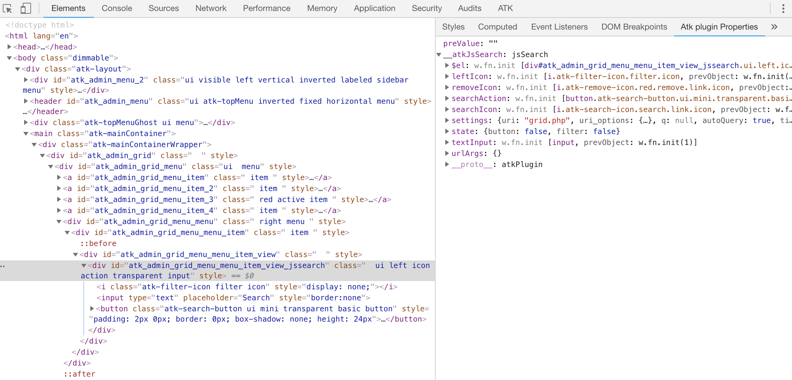

## Agile Toolkit Extension for Chrome.

Help debuging javascript when using Agile Toolkit framework.

### Callback debug

The ATK develppper panel will properly formatted json response into readable code in order
to help debugging javascript action return by server.

### Plugin property content

This is a sidebar panel available when using the Element panel in Chrome. 
It will display jQuery data property of a selected element.

### Manual Installation

**Make sure you are using Node 6+ and NPM 3+**

1. Clone this repo
2. Open Chrome extension page
3. Check "developer mode"
4. Click "load unpacked extension", and choose `atkjs-chrome`.

### License

[MIT](http://opensource.org/licenses/MIT)
